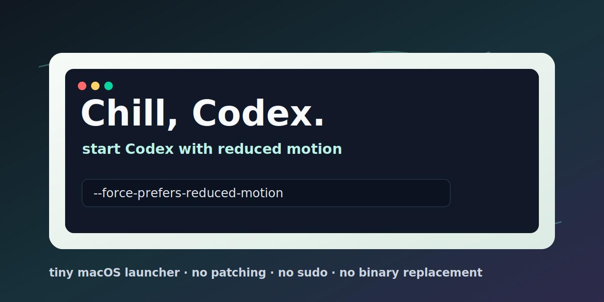

# Chill, Codex.

> Codex 때문에 Mac이 이륙 준비를 하는 것처럼 들리지 않게 합니다.

[](https://github.com/cpiz/chill-codex/actions/workflows/test.yml)

**언어:** [English](README.md) | [简体中文](README.zh-CN.md) | [日本語](README.ja.md) | 한국어



## 이 프로젝트가 있는 이유

Codex를 좋아하지만, 긴 세션 중에 Mac이 갑자기 이륙 준비를 하는 것처럼 소리를 내기 시작하는 이상한 상황을 겪었습니다.

처음에는 메모리 압박, WindowServer, 디스플레이 스케일링, 다른 Electron 앱, 백그라운드 도구 등 여러 원인을 의심했습니다. 며칠 동안 확인해 보니, 제 환경에서는 Codex를 Chromium의 reduced-motion 플래그와 함께 실행하는 workaround가 실제로 도움이 되었습니다.

그래서 이 프로젝트는 의도적으로 작게 만들었습니다. Codex를 패치하거나, Codex를 대체하거나, 성능 수정 도구인 척하지 않습니다. 그저 Codex를 더 차분한 모드로 실행하는 작은 런처를 만들 뿐입니다.

Chill Codex는 `Chill Codex.app` 런처를 만드는 작은 macOS 설치 스크립트입니다. 공식 Codex 앱을 reduced-motion Chromium 플래그와 함께 실행해, 긴 Codex 작업 중 UI 모션과 렌더링 부담을 줄입니다.

공식 Codex 앱을 수정하거나, 바이너리를 교체하거나, 자동 업데이트를 끄거나, 시스템 설정을 바꾸지 않습니다. 생성되는 wrapper app은 실행 시 다음 명령을 사용합니다.

```sh
open -na /Applications/Codex.app --args --force-prefers-reduced-motion
```

## 하는 일

| 하는 일 | 하지 않는 일 |
| --- | --- |
| 작은 런처 app을 만듭니다 | Codex를 패치하지 않습니다 |
| Chromium 플래그 하나를 전달합니다 | 바이너리를 교체하지 않습니다 |
| 기본적으로 `~/Applications`에 설치합니다 | `sudo`를 요구하지 않습니다 |
| 가능하면 Codex app 아이콘을 복사합니다 | Codex 자동 업데이트를 끄지 않습니다 |

## 빠른 설치

```sh
sh -c "$(curl -fsSL https://raw.githubusercontent.com/cpiz/chill-codex/main/install.sh)"
```

설치 후:

1. Codex가 이미 실행 중이면 종료합니다.
2. `~/Applications/Chill Codex.app`을 엽니다.
3. 기본 실행 방식으로 쓰고 싶다면 `Chill Codex.app`을 Dock에 고정합니다.

## 동작 확인

`Chill Codex.app`으로 Codex를 실행한 뒤 다음을 실행합니다.

```sh
ps axww -o command | grep 'Codex.app/Contents/MacOS/Codex'
```

Codex 메인 프로세스에 다음 인자가 보이면 적용된 것입니다.

```text
/Applications/Codex.app/Contents/MacOS/Codex --force-prefers-reduced-motion
```

## 더 신중한 설치

원격 스크립트를 바로 실행하고 싶지 않다면, 먼저 다운로드하고 확인한 뒤 실행할 수 있습니다.

```sh
curl -fsSLO https://raw.githubusercontent.com/cpiz/chill-codex/main/install.sh
less install.sh
sh install.sh
```

## 제거

가장 간단한 방법은 다음 항목을 삭제하는 것입니다.

```text
~/Applications/Chill Codex.app
```

제거 스크립트를 사용할 수도 있습니다.

```sh
sh -c "$(curl -fsSL https://raw.githubusercontent.com/cpiz/chill-codex/main/uninstall.sh)"
```

제거 스크립트는 `chill-codex.generated` 마커가 있는 app bundle만 삭제하므로, 같은 이름의 다른 앱은 삭제하지 않습니다.

## 사용자 지정 경로

기본적으로 설치 스크립트는 다음 경로를 찾습니다.

```text
/Applications/Codex.app
```

런처는 다음 위치에 설치됩니다.

```text
~/Applications/Chill Codex.app
```

옵션으로 값을 바꿀 수 있습니다.

```sh
sh install.sh \
  --codex-app "/Applications/Codex.app" \
  --install-dir "$HOME/Applications" \
  --app-name "Chill Codex"
```

환경 변수로도 바꿀 수 있습니다.

```sh
CODEX_APP_PATH="/Applications/Codex.app" \
CHILL_CODEX_INSTALL_DIR="$HOME/Applications" \
CHILL_CODEX_APP_NAME="Chill Codex" \
sh install.sh
```

## 작동 방식

Codex의 모델 추론은 원격에서 실행되지만, 데스크톱 앱은 로컬 Electron/Chromium UI, 로컬 서비스, 도구 호출, 창 렌더링을 계속 실행합니다. 긴 세션에서는 잦은 애니메이션, 새로고침, 합성이 macOS GPU와 WindowServer에 추가 부담을 줄 수 있습니다.

Chromium/Electron은 `--force-prefers-reduced-motion` 플래그를 지원합니다. Chill Codex가 생성한 런처는 이 플래그로 Codex를 실행해 UI가 reduced-motion 동작을 더 선호하도록 합니다.

이 프로젝트는 팬이 절대 돌지 않는다고 보장하지 않습니다. 목표는 한 가지 제한적인 workaround입니다. Codex의 긴 작업 중 UI 모션과 렌더링으로 생기는 추가 로컬 부하를 줄이는 것입니다.

## 개발

소셜 프리뷰 에셋은 `assets/`에 있습니다. GitHub 저장소 Social preview 이미지로는 `assets/social-preview.png`를 사용합니다.

테스트 실행:

```sh
sh test/install-test.sh
```

스크립트 문법 확인:

```sh
sh -n install.sh
sh -n uninstall.sh
sh -n test/install-test.sh
```

## 호환성

- 시스템: macOS
- 기본 Codex 경로: `/Applications/Codex.app`
- 기본 설치 위치: `~/Applications/Chill Codex.app`

## 면책 조항

Chill Codex는 OpenAI 공식 프로젝트가 아닙니다. Codex 앱을 수정하거나, 패치하거나, 크랙하거나, 재배포하지 않습니다. 향후 Codex 릴리스에서 Chromium/Electron 시작 플래그 동작이 바뀌면 이 workaround는 조정이 필요할 수 있습니다.

## License

MIT
